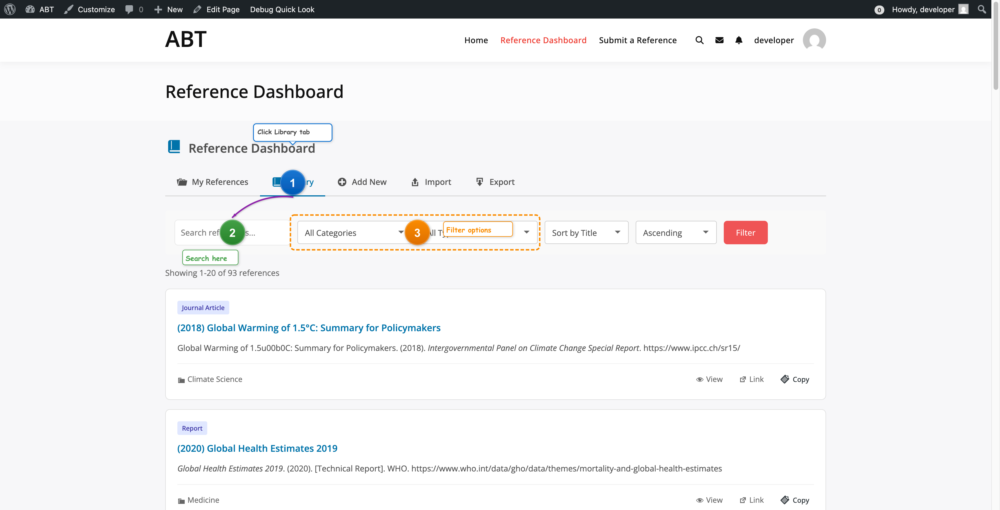

# Image Annotator MCP Server

Professional MCP server for annotating screenshots with markers, arrows, callouts, and more. Works seamlessly with Playwright MCP for documentation workflows.



## Features

- **Multiple Annotation Types**: Markers, arrows, callouts, rectangles, circles, labels, highlights, blur, connectors, and icons
- **Professional Styling**: Gradient markers with shadows, customizable colors and themes
- **Theme Support**: Pre-built themes for documentation, tutorials, bug reports, and highlights
- **6 MCP Tools**: Different tools for different use cases

## Installation

### For Claude Desktop

Add to your Claude Desktop config (`~/Library/Application Support/Claude/claude_desktop_config.json`):

```json
{
  "mcpServers": {
    "image-annotator": {
      "command": "node",
      "args": ["/path/to/.mcp-servers/image-annotator/server.js"]
    }
  }
}
```

### Dependencies

```bash
cd image-annotator
npm install
```

## MCP Tools

### `annotate_screenshot`
Add multiple annotations to a screenshot image.

**Annotation Types:**
- `marker` - Numbered circles (1, 2, 3...) with gradient and shadow
- `arrow` - Straight arrows with customizable heads
- `curved-arrow` - Smooth curved arrows
- `callout` - Text boxes with pointers (speech bubbles)
- `rect` - Rectangle highlights
- `circle` - Circle highlights
- `label` - Text labels with optional backgrounds
- `highlight` - Semi-transparent overlays
- `blur` - Blur sensitive content
- `connector` - Dashed lines between elements
- `icon` - Icon badges (check, x, warning, info, question)

**Themes:** `documentation`, `tutorial`, `bugReport`, `highlight`

**Colors:** red, orange, yellow, green, blue, purple, pink, cyan, teal, white, black, gray, lightGray, darkGray, success, warning, error, info, primary, secondary, accent

### `get_image_dimensions`
Get width, height, and format of an image. Essential for calculating annotation coordinates.

### `create_step_guide`
Create a numbered step-by-step guide on a screenshot. Automatically places numbered markers with labels and connecting arrows.

### `highlight_area`
Quickly highlight a specific area with a shape (circle, rect, highlight) and optional label.

### `add_callout`
Add a callout (speech bubble) pointing to a specific location.

### `blur_area`
Blur a rectangular area to hide sensitive information.

## Usage Example

```json
{
  "input_path": "/path/to/screenshot.png",
  "annotations": [
    {"type": "marker", "x": 100, "y": 100, "number": 1, "color": "primary", "size": 28},
    {"type": "arrow", "from": [130, 100], "to": [200, 150], "color": "red", "strokeWidth": 3},
    {"type": "label", "x": 210, "y": 155, "text": "Click here!", "background": "white", "shadow": true},
    {"type": "callout", "x": 300, "y": 200, "text": "Important!", "pointer": "left", "color": "orange"},
    {"type": "rect", "x": 50, "y": 250, "width": 200, "height": 100, "color": "green", "style": "dashed"},
    {"type": "icon", "x": 400, "y": 100, "icon": "check", "color": "success"}
  ]
}
```

## Workflow with Playwright MCP

For accurate annotation positioning, use Playwright to get real element coordinates:

### Step 1: Navigate and Screenshot
```
browser_navigate → browser_take_screenshot
```

### Step 2: Get Element Positions
Use `browser_evaluate` to get bounding boxes:
```javascript
() => {
  const el = document.querySelector('[role="tab"]');
  const rect = el.getBoundingClientRect();
  return { x: rect.x, y: rect.y, width: rect.width, height: rect.height };
}
```

### Step 3: Scale for Retina (2x)
If screenshot is at 2x scale, multiply coordinates by 2.

### Step 4: Annotate with Real Positions
```json
{
  "input_path": "/path/to/screenshot.png",
  "annotations": [
    {"type": "marker", "x": 1010, "y": 630, "number": 1, "color": "primary"},
    {"type": "callout", "x": 1010, "y": 500, "text": "Click here", "pointer": "bottom"}
  ]
}
```

### Step 5: Upload
Upload annotated image to Basecamp: `basecamp_comment_with_file`

## CLI Usage

```bash
# Annotate an image
node annotate.js input.png output.png --annotations '[{"type":"marker","x":100,"y":100,"number":1}]'

# Get image dimensions
node annotate.js --dimensions input.png
```

## License

MIT License - see [LICENSE](LICENSE) file.

## Author

Varun Dubey <varun@wbcomdesigns.com>
